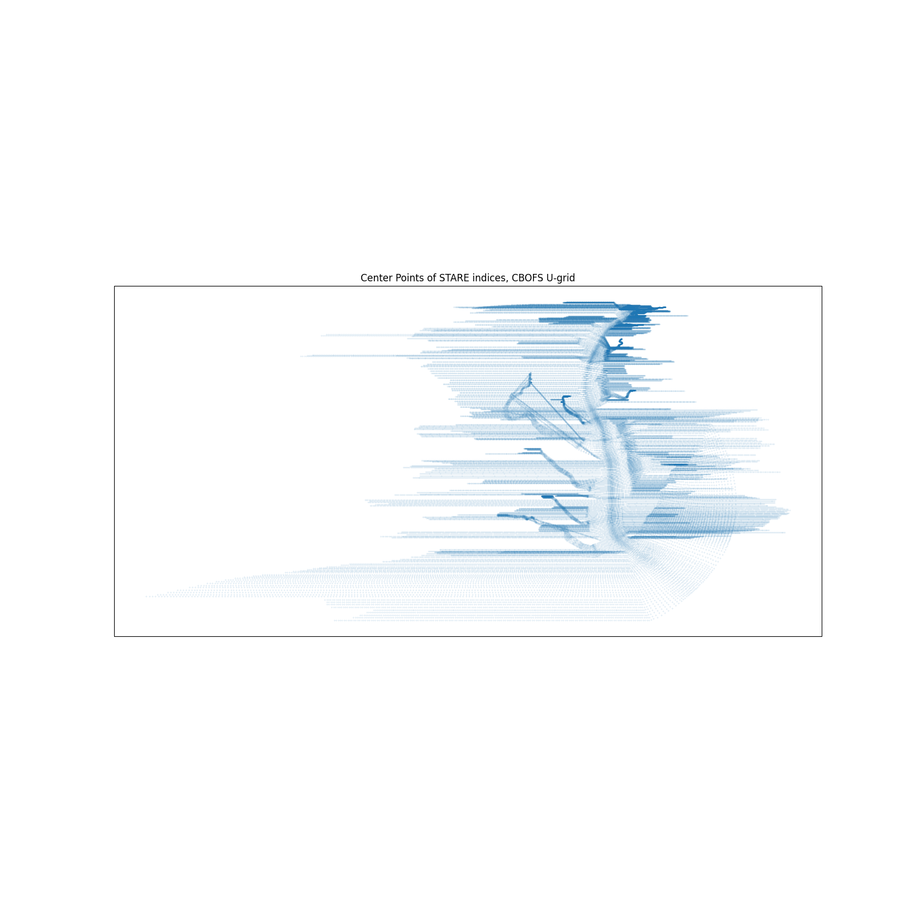

# *CBOFS_STARE*

Exploring the STARE library with ROMS output for the Chesapeake Bay



I first learned about [STARE](https://github.com/SpatioTemporal/STARE) in 2019 at the ESIP Summer Meeting.
Side note, awesome time and the folks there are great. STARE, or Spatio-Temporal Adaptive Resolution Encoding,
is a really cool way to encode geophysical and temporal location into a single database index, namely for SciDB.
Having dealt with large volumes of geospatial data varying in format, time, and location, I wanted to try
STARE out for myself.

This repo - at least, at this moment - does not use STARE to its full capacity. It's really a
demonstration on how STARE can be used with any geo-located data. I chose the [ROMS](https://www.myroms.org/)
model output for the Chesapeake Bay, [CBOFS](https://tidesandcurrents.noaa.gov/ofs/cbofs/cbofs.html).

## Build Environment

```
Ubuntu 16.04 (I know, I should upgrade...)
gcc (Ubuntu 5.4.0-6ubuntu1~16.04.12) 5.4.0 20160609
cmake version 3.15.0
```

Libraries:
- HDF5 (for NetCDF) - 1.8.19
- ZLIB (for NetCDF) - 1.2.5.3
- NetCDF - 4.4.1.1
- STARE - 0.16.3 
- PySTARE (Python STARE interface) - 0.5.5

## External Data

ROMS data for the Chesapeake Bay Operational Forecast Model (CBOFS):

```
$ wget "https://nomads.ncep.noaa.gov/pub/data/nccf/com/nos/prod/cbofs.20210403/nos.cbofs.fields.f001.20210403.t00z.nc"
```

## High-level Notes

The STARE-related repository, [STAREmaster](https://github.com/SpatioTemporal/STAREmaster), contains
interfaces and tools to make a "side-car file" where the STARE index information can be stored. Because
this is a pretty high-level demonstration, I chose to not implement a ROMS-STARE interface there (yet) as
that interface currently deals mostly with satellite data. Also, I reiterate, this is a demonstration.

## Exploration and current challenges

__Step 1__: Generate STARE location indices for the U/V CBOFS grids

I wanted to test out how the STARE C++ API worked, so I made a small test program
to extract the eta-u/xi-u and eta-v/xi-v component grids. The grids are curvilinear,
and the geophysical locations of grid points are two-dimensional with `(eta_u, xi_u)`
as the logical dimensions for the u-component grid and `(eta_v, xi_v)` for the v-component
grid. The sizes of `eta_u, xi_u, eta_v, xi_v` are all known beforehand, and are thus defined
as macros in the demonstration program. The `netcdf-c` library is used to extract
the necessary latitude and longitude variables for each grid and then computes the `STARE`
indices. Results are written to a new NetCDF file, `cbofs_STARE.nc`.

__Step 2__: Plot the STARE indices on a map

To verify that the `STARE` indices are indeed encoding the correct location data, I use
`matplotlib` to plot the center point of each `STARE` triangle. Each triangle represents
the smallest area that, through `STARE`, the data is able to encode. Numerical modeling is
obviously very computationally intensive, and thus the grid resolutions are chosen to provide
a balance between precision and performance.

The result is the figure at the top of this `README`. As you can see, it's a work in progress:
many vertices seem to be taking place over land. Initially, I thought I could fix this by
incorporating the land mask array given in the CBOFS output file. This didn't work - it removed
some land points, but also removed some water points which is obviously not desired.

The fact that the land points aren't fully masked (perhaps this is a curvilinear transformation
issue I'm running into?) isn't necessarily a bad thing though. In fact, it's consistent with
the results from plotting the latitude and longitude of the raw data itself, which suggests
that the `STARE` indices are coirrectly computed.

## Challenges

1. Grid transformations: Since the CBOFS grid(s) is(are) curvilinear, there are
some funky transformations going on. Is theis the reason why some of the land cells
are being shown, even when using the land mask? This seems to be more of a visualization
caveat than a `STARE` concern.

2. OpenMP speed-up is imperceptible. I suspect this is because the CBOFS file is not exactly huge,
and simply extracting the latitude and longitude points aren't super time intensive. Still, any
loop-carried dependencies? Could also try leveraging compiler vectorization...

3. Grid resolution adaption - can we do it? The CBOFS grid is fairly dense. Since we computed the
`STARE` indices at the highest build resolution, we could see if we can leverage `PySTARE` further
to "zoom-out" and decrease our resolution just for a more visually-pleasing aesthetic.

### Building

If you want to build and run this exploration, first ensure you have the appropriate data and a
Python (3.5+) environment built with installed dependencies. You'll also need access to the STARE
library (you'll likely have to build from source) and the netcdf-c library.

```
$ bash build.bash
$ ./a.out
$ source env/bin/activate
$ pip install -r requirements.txt
$ bash install_pystare.bash
$ python plot_grid.py
```
